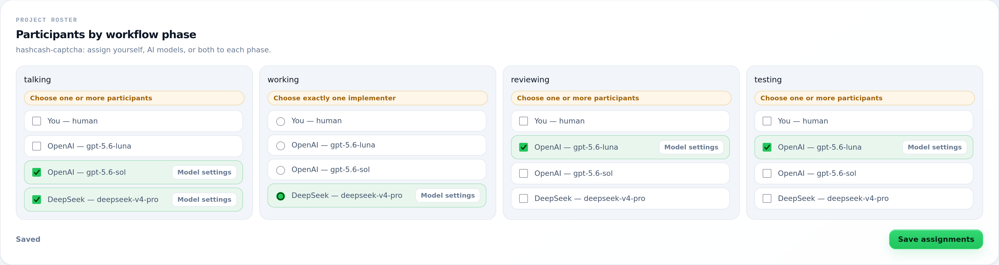
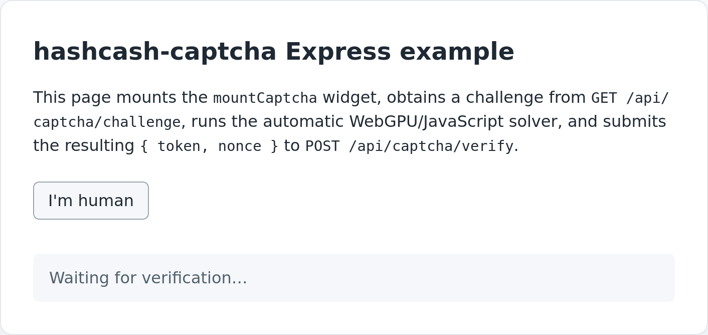

This code was written using [https://gg-ai.dev](https://gg-ai.dev)

Here's the VISION used:

```
Create a Proof-of-work-based, CAPTCHA-like, nodejs library, called HashcashCAPTCHA

- Similar to Friendly CAPTCHA, and Hashcash
- Should encompass the server-side code + the browser client code
- Use SHA-256 hash for the PoW solution
- Use efficient crypto in the backend and front-end
- Front-end must use WebGPU when available or fallback to JavaScript when there's no WebGPU
- WebGPU should return only the correct nonce
- Implement SHA-256 for WebGPU and keep a fallback JS path
- It should not assume an specific library in the server
- There should be 2 ways of remembering past tokens: Redis-based and memory-based
- The widget should have customizable strings, default is: "I'm human"
- The widget should be similar to the existing industry ones
- The widget should have nice animations, and allow cancelling the run
- There should be examples of integration with popular frameworks such as express
```

Some of the first iteration problems:
```

  - High: WebGPU miscounts leading-zero bits across 32-bit words. In src/pow.webgpu.js:146,
    each preceding zero word contributes i * 8, but a word contains 32 bits. It must be i *
    32. For example, [0x00000000, 0x80000000, ...] has 32 leading zero bits but is reported
    as 8. The GPU solver can consequently miss valid nonces and incorrectly exhaust
    maxAttempts, particularly at higher difficulties.

  - Medium: The shader uses atomicCompareExchangeWeak only once at src/pow.webgpu.js:249.
    Weak compare-exchange may fail spuriously, so a dispatch containing a valid nonce can
    theoretically return “not found.” It should retry while the flag remains zero or use a
    construction not dependent on one weak attempt.

  - Low: RedisTokenStore.get() does not discard malformed or logically expired records as
    required by its documented store contract. src/redis-store.js:169 merely decodes and
    returns null; it never calls del. Redis TTL normally limits the impact, but clock skew or
    malformed values can leave unusable entries behind.

```

Second VISION:
```
evaluate the code and look for implementation bugs
```

**No more issues found, the resulting code is the one in this repo.**

Here's the roster:



Here's what it looks like:



----

# hashcash-captcha

A minimal Node.js SHA-256 proof-of-work core for nonce-based challenges. It can
hash a challenge plus nonce, evaluate a leading-zero-bit difficulty, solve for a
valid nonce, and verify a submitted nonce.

## Installation

```sh
npm install
```

The server entry point has no runtime dependencies; it uses only the standard
Node.js `node:crypto` module. A dependency-free browser fallback is available at
the `hashcash-captcha/browser` subpath, a browser WebGPU solver is available at
the `hashcash-captcha/webgpu` subpath, a browser client dispatcher is available
at the `hashcash-captcha/client` subpath, a framework-agnostic browser CAPTCHA
widget is available at the `hashcash-captcha/widget` subpath, an
instance-based challenge service is available at the
`hashcash-captcha/server` subpath, and a Redis-backed token store is available
at the `hashcash-captcha/redis` subpath. To run the automated unit test suite:

```sh
npm test
```

## Challenge-plus-nonce encoding

Hash inputs use one unambiguous byte encoding:

1. `challenge` must be a `string`, `Buffer`, or `Uint8Array`.
   - Strings are encoded as UTF-8 bytes.
   - Buffers and `Uint8Array`s are used byte-for-byte.
2. `nonce` must be a non-negative safe integer (`0 <= nonce <= Number.MAX_SAFE_INTEGER`).
3. The bytes that are hashed are the challenge bytes followed by the nonce as an
   unsigned **8-byte big-endian** value.

Because the nonce field has a fixed width, every distinct `(challenge, nonce)`
pair maps to a distinct byte sequence, so identical challenge and nonce values
always produce the same SHA-256 digest.

Difficulty is an integer number of leading zero bits, from `0` through `256`.
`meetsDifficulty` and `verify` accept a difficulty of `0` (always true) up to
`256` (only the all-zero digest).

## Example

```js
import { solve, verify } from 'hashcash-captcha';

const challenge = 'example-challenge';
const difficulty = 8;

const nonce = solve(challenge, difficulty);
console.log(nonce); // e.g. 357

console.log(verify(challenge, nonce, difficulty)); // true
console.log(verify(challenge, nonce + 1, difficulty)); // false (with high probability)
```

## Browser fallback

The `hashcash-captcha/browser` subpath exports the same challenge-plus-nonce
encoding and hash helpers, plus an asynchronous `solve` that works in browsers
without Node.js built-ins or runtime dependencies. It yields to the event loop
between bounded batches and supports cooperative cancellation with an
`AbortSignal`.

```js
import { solve } from 'hashcash-captcha/browser';

const controller = new AbortController();
const challenge = 'example-challenge';
const difficulty = 8;

try {
  const nonce = await solve(challenge, difficulty, {
    maxAttempts: 200000,
    batchSize: 2048,
    signal: controller.signal
  });
  console.log(nonce);
} catch (error) {
  if (error.name === 'AbortError') {
    console.log('solving was cancelled');
  } else {
    throw error;
  }
}

// Cancel an in-progress run from elsewhere:
// controller.abort();
```

The browser `solve` accepts `string`, `Uint8Array`, or `ArrayBuffer`
challenges, a leading-zero-bit difficulty from `0` through `256`, and options
`start`, `maxAttempts`, `batchSize`, and `signal`. It rejects with an
`AbortError` when the signal is already aborted or becomes aborted between
batches, and rejects with an `Error` when `maxAttempts` is exhausted.

## WebGPU solver

The `hashcash-captcha/webgpu` subpath exports an asynchronous, browser-only
WebGPU SHA-256 proof-of-work solver. It has no Node.js imports and no runtime
dependencies. The solver uses a WGSL compute shader implementing SHA-256 over
the existing challenge-plus-8-byte-big-endian-nonce encoding, searches bounded
nonce ranges in parallel, and returns one winning nonce or a not-found
sentinel per dispatch. Per-attempt digests and attempted nonces are not copied
back to JavaScript.

WebGPU is available in current Chrome and Edge, and is not available in all
browsers or browsing contexts (for example private windows, headless browsers,
or systems without a compatible GPU/driver). When WebGPU is unavailable,
`solveWebGpu` rejects with a `WebGpuUnavailableError`; callers should catch
that error and explicitly fall back to the JavaScript solver from
`hashcash-captcha/browser`.

```js
import { solveWebGpu, WebGpuUnavailableError } from 'hashcash-captcha/webgpu';
import { solve as solveOnCpu } from 'hashcash-captcha/browser';

const challenge = '0123456789abcdef0123456789abcdef0123456789abcdef0123456789abcdef';
const difficulty = 10;

try {
  const nonce = await solveWebGpu(challenge, difficulty, {
    maxAttempts: 200000,
    batchSize: 65536
  });
  console.log(nonce);
} catch (error) {
  if (error instanceof WebGpuUnavailableError) {
    console.log('WebGPU unavailable; using the JavaScript fallback');
    console.log(await solveOnCpu(challenge, difficulty));
  } else {
    throw error;
  }
}
```

`solveWebGpu(challenge, difficulty, options?)` accepts:

- `challenge`: a UTF-8 `string`, `Uint8Array`, or `ArrayBuffer`, including the
  64-character hex challenge strings issued by `hashcash-captcha/server`.
- `difficulty`: an integer number of leading zero bits from `0` through `256`.
- `options.start` (default `0`): non-negative safe integer to start from.
- `options.maxAttempts` (default `1000000`): maximum nonce values to try.
- `options.batchSize` (default `262144`): nonces searched per bounded GPU
  dispatch. It must not exceed the device's maximum compute dispatch size.
- `options.signal`: optional `AbortSignal`. The solver checks the signal before
  each bounded dispatch and rejects with an `AbortError` if it is already
  aborted or becomes aborted while GPU work is in flight.

Before resolving, `solveWebGpu` verifies the returned nonce with the browser
SHA-256 implementation from `hashcash-captcha/browser` and rejects with a
`WebGpuResultError` if the GPU result is invalid. If the WebGPU device is lost
during the operation, it rejects with a `WebGpuDeviceLostError` rather than
returning an unchecked nonce. GPU resources are released after success,
failure, cancellation, or device loss.

The subpath also exports `sha256WebGpu(data, options?)`, which returns the
lowercase hexadecimal SHA-256 digest of one `string`, `Uint8Array`, or
`ArrayBuffer` input. It is useful for WebGPU SHA-256 parity checks. The
proof-of-work solver itself never copies per-attempt digests back to
JavaScript.

### Running the WebGPU browser integration test

The browser integration test requires a real WebGPU context and loads ES
modules, so serve the project and open the test page rather than opening it as
a `file://` URL:

```sh
npm run test:webgpu:serve
```

Then open `http://127.0.0.1:8123/test/webgpu.browser.html` in Chrome or Edge
with WebGPU enabled. The page verifies GPU SHA-256 parity for one-block and
two-block inputs and solves a low, non-byte-aligned difficulty challenge. The
test page reports `SKIP` when WebGPU is unavailable.

## Browser client dispatcher

The `hashcash-captcha/client` subpath exports a browser-compatible ES module
that solves a challenge with WebGPU when available and transparently falls back
to the dependency-free JavaScript solver otherwise. It imports only
`./pow.browser.js` and `./pow.webgpu.js`.

```js
import { hasWebGpu, solveAuto } from 'hashcash-captcha/client';

const challenge = '0123456789abcdef0123456789abcdef0123456789abcdef0123456789abcdef';
const difficulty = 10;
const controller = new AbortController();

console.log('WebGPU available:', hasWebGpu());

try {
  const nonce = await solveAuto(challenge, difficulty, {
    maxAttempts: 200000,
    batchSize: 65536,
    signal: controller.signal
  });
  console.log(nonce);
} catch (error) {
  if (error.name === 'AbortError') {
    console.log('solving was cancelled');
  } else {
    throw error;
  }
}
```

`solveAuto(challenge, difficulty, options?)` accepts a UTF-8 `string`,
`Uint8Array`, or `ArrayBuffer` challenge, an integer leading-zero-bit
difficulty from `0` through `256`, and the same options as the underlying
solvers: `start`, `maxAttempts`, `batchSize`, and `signal`.

It first attempts `solveWebGpu` with exactly those arguments. If that attempt
rejects with `WebGpuUnavailableError` — for example when `navigator.gpu` is
absent or no adapter/device can be acquired — it automatically invokes the
JavaScript `solve` from `hashcash-captcha/browser` with the same arguments and
resolves with the winning nonce. Other rejections propagate unchanged and do
not fall back, including `AbortError`, `WebGpuDeviceLostError`,
`WebGpuResultError`, validation `TypeError`/`RangeError`, and max-attempt
exhaustion.

A single `AbortSignal` drives both paths. If the signal is already aborted,
`solveAuto` rejects with an `AbortError` before any solving work. If the signal
aborts while either solver is running, the same `AbortError` is propagated.

`hasWebGpu(globalObject = globalThis)` returns `true` only when
`globalObject.navigator.gpu` exists and `gpu.requestAdapter` is callable. It
returns `false` when `navigator` is absent, when `gpu` or `requestAdapter` is
missing or not callable, or when accessing any of those properties throws.

## Browser CAPTCHA widget

The `hashcash-captcha/widget` subpath exports `mountCaptcha`, a minimal
framework-agnostic browser widget. It renders a self-contained “I'm human”
control into a caller-supplied DOM element, runs the automatic
WebGPU/JavaScript solver from `hashcash-captcha/client`, and supports cancelling
an active proof-of-work run.

```html
<div id="captcha"></div>
<script type="module">
  import { mountCaptcha } from 'hashcash-captcha/widget';

  const widget = mountCaptcha(document.getElementById('captcha'), {
    // Use a challenge payload directly, or replace this with getChallenge.
    challenge: {
      token: 'issued-token',
      challenge: '0123456789abcdef0123456789abcdef0123456789abcdef0123456789abcdef',
      difficulty: 16
    },
    onSolved(result) {
      console.log('solved', result); // { token: 'issued-token', nonce: 42 }
    }
  });

  // Later: widget.reset(); or widget.destroy();
</script>
```

`mountCaptcha(container, options)` appends the widget to `container` and
returns `{ reset, destroy }`. It does not require React, Vue, or any other UI
framework, and all widget markup and styles stay inside the rendered subtree.

Challenge delivery:

- `options.challenge` supplies a `{ token, challenge, difficulty }` payload
  directly.
- `options.getChallenge` supplies an async callback that returns that payload.
  It is called with `{ signal }`, the same `AbortSignal` used for the solve, so
  a challenge fetch can also be aborted.

When activation succeeds, the widget calls `options.onSolved({ token, nonce })`
and dispatches a `hashcash:solved` `CustomEvent` that bubbles from the widget.
The event `detail` is `{ token, nonce }`. A non-cancellation solver failure
dispatches `hashcash:error` with `{ error }` and calls `options.onError` when
provided.

Strings are customizable through `idleLabel` (default `I'm human`),
`solvingLabel` (default `Verifying…`), `cancelLabel` (default `Cancel`),
`solvedLabel` (default `Verified`), and `errorLabel` (default
`Verification failed`).

```js
const widget = mountCaptcha(container, {
  async getChallenge({ signal }) {
    const response = await fetch('/captcha/challenge', { signal });
    return await response.json();
  },
  onSolved({ token, nonce }) {
    console.log('submit', { token, nonce });
  },
  idleLabel: 'I am not a robot',
  solvingLabel: 'Checking…',
  cancelLabel: 'Stop',
  solvedLabel: 'Ready',
  errorLabel: 'Please try again'
});
```

While solving, the widget shows an animated progress indicator and a cancel
control. The cancel control aborts the shared `AbortSignal` and returns the
widget to idle without emitting a solved result. The `reset()` method also
aborts any active work and returns the widget to idle. The `destroy()` method
aborts any active work, removes the rendered widget, and removes its event
handlers.

```js
document.getElementById('cancel-everything').addEventListener('click', () => {
  widget.reset(); // or widget.destroy()
});
```

For tests and custom solver adapters, `options.solve` can replace the default
`hashcash-captcha/client` `solveAuto`. It must match the solver signature
`(challenge, difficulty, options) => Promise<nonce>`.

A browser DOM fixture is available at `test/widget.browser.html`. It can be
served with `npm run test:webgpu:serve` and opened at
`http://127.0.0.1:8123/test/widget.browser.html`.

## Server challenge service

The `hashcash-captcha/server` subpath exports a framework-agnostic,
instance-based challenge service. It issues expiring, single-use challenges and
verifies submitted nonces against the existing proof-of-work verifier. The
service keeps no module-global state and has no web-framework dependencies.

```js
import { createChallengeService } from 'hashcash-captcha/server';
import { solve } from 'hashcash-captcha';

const service = createChallengeService({
  difficulty: 16, // leading zero bits, 0 through 256
  ttl: 60000      // challenge lifetime in milliseconds
});

const { token, challenge, difficulty, expiresAt } =
  await service.issueChallenge();

// In a real browser, use the solver from `hashcash-captcha/browser` instead.
const nonce = solve(challenge, difficulty);

console.log(await service.verifySolution(token, nonce)); // true
console.log(await service.verifySolution(token, nonce)); // false (replay)
```

`createChallengeService(options)` accepts:

- `difficulty` (default `16`): leading-zero-bit difficulty, an integer from `0`
  through `256`.
- `ttl` (default `300000`): challenge lifetime in milliseconds.
- `now` (default `Date.now`): injectable clock function returning epoch
  milliseconds.
- `store` (default `new MemoryTokenStore({ now })`): injectable asynchronous
  token store.

`issueChallenge()` generates a cryptographically random token and challenge,
stores the challenge record, and resolves with `{ token, challenge,
difficulty, expiresAt }`. `expiresAt` is an epoch-millisecond timestamp the
browser solver can use as a deadline.

`verifySolution(token, nonce)` resolves `true` only for the first correct
nonce. It resolves `false` for unknown, expired, malformed, or incorrect
submissions and does not throw for those cases. A challenge record is consumed
only after a correct solution, so incorrect attempts do not destroy the
challenge.

### Store lifecycle and custom stores

`MemoryTokenStore` is the default in-memory store. Each instance owns a
private `Map`, so instances never share records. When a record is read,
written, consumed, or counted, the store discards any expired records it
observes. `get` and `consume` return copies, never the internal record objects,
so callers cannot mutate stored state through a returned value.

`RedisTokenStore` uses the same asynchronous contract:

- `get(token, nowMs?)` → record copy or `null`, discarding expired records.
- `set(token, record, nowMs?)` → store a record.
- `consume(token, nowMs?)` → atomically remove and return a record copy, or
  `null` when unknown/expired.

`nowMs` is an optional epoch-millisecond timestamp injected by the service.
Atomic `consume` is what makes concurrent single-use verification safe, so a
Redis implementation must implement it atomically (for example with a Lua
script).

A stored record has this shape:

```js
{
  token: 'hex token',
  challenge: 'hex challenge',
  difficulty: 16,
  createdAt: 1720000000000,
  expiresAt: 1720000060000
}
```

## Redis token store

The `hashcash-captcha/redis` subpath exports `RedisTokenStore`, a
Redis-backed implementation of the same asynchronous token-store contract as
`MemoryTokenStore`. It has no dependency on a specific Redis client library;
you inject an async Redis-compatible client that implements the minimal
interface below.

```js
import { createChallengeService } from 'hashcash-captcha/server';
import { RedisTokenStore } from 'hashcash-captcha/redis';

const store = new RedisTokenStore(redisClient, {
  prefix: 'hashcash:', // optional key prefix, default ''
  now: () => Date.now() // optional clock, default Date.now
});

const service = createChallengeService({ store });
```

`new RedisTokenStore(client, options)` accepts:

- `client` (required): an async Redis-compatible client with the methods
  described below.
- `options.prefix` (default `''`): a string prepended to every Redis key, so
  multiple stores can share one Redis database without colliding.
- `options.now` (default `Date.now`): injectable clock function returning epoch
  milliseconds, matching the service's clock injection.

`RedisTokenStore` implements:

- `get(token, nowMs?)` → a copy of the stored record, or `null` when the key is
  missing, the JSON is malformed, or the record is expired.
- `set(token, record, nowMs?)` → stores a serialized record copy with a Redis
  `PX` TTL derived from `record.expiresAt - nowMs`.
- `consume(token, nowMs?)` → atomically removes and returns a record copy, or
  `null`. It uses a Lua script through `client.eval`, so concurrent consumers
  of the same token succeed for exactly one caller.

The injected client must implement this asynchronous contract:

- `get(key)` → Promise resolving to the stored string, or `null` when the key
  is absent.
- `set(key, value, { PX: ttlMs })` → Promise that stores `value` with a
  millisecond TTL and resolves when the write is durable.
- `del(key)` → Promise that removes the key.
- `eval(script, { keys, arguments })` → Promise that evaluates `script` on the
  server with the given `keys` and `arguments` and resolves with the Lua
  script's return value.

This matches the `node-redis` v4+ command signatures. Other Redis clients can
be used with a thin adapter that maps their command style to this contract.

```js
import { createChallengeService } from 'hashcash-captcha/server';
import { RedisTokenStore } from 'hashcash-captcha/redis';

const service = createChallengeService({
  difficulty: 16,
  ttl: 60000,
  store: new RedisTokenStore(redisClient, { prefix: 'hashcash:' })
});
```

## Express integration example

A runnable Express example lives in [`examples/express/`](examples/express/). It
connects the existing challenge service, browser widget, and automatic
WebGPU/JavaScript solver through HTTP endpoints, and it demonstrates the full
browser flow: mount `mountCaptcha`, fetch a challenge, solve it, and submit
`{ token, nonce }` for server verification.

The Express dependency exists only in this example and in the integration test.
The library's runtime dependencies remain unchanged.

```sh
npm install
npm run example:express
```

Then open <http://127.0.0.1:3000>. The example exposes:

- `GET /api/captcha/challenge` — issues and returns
  `{ token, challenge, difficulty, expiresAt }` as JSON with
  `Cache-Control: no-store`.
- `POST /api/captcha/verify` — accepts `{ token, nonce }`, calls
  `verifySolution`, and returns `{ ok: true }` or `{ ok: false }` without
  exposing stored challenge records.
- `GET /` — serves the browser page that mounts `mountCaptcha`.

Difficulty and TTL are configured with `CAPTCHA_DIFFICULTY` (default `16`) and
`CAPTCHA_TTL_MS` (default `300000`); `PORT` and `HOST` select the listen
address. The example's default `MemoryTokenStore` is process-local, so it does
not survive restarts or share challenges across processes. Use the existing
`RedisTokenStore` as the production alternative:

```js
import { createClient } from 'redis';
import { RedisTokenStore } from 'hashcash-captcha/redis';
import { createExpressApp } from './examples/express/server.js';

const redisClient = createClient();
await redisClient.connect();

const app = createExpressApp({
  difficulty: 16,
  ttl: 60_000,
  store: new RedisTokenStore(redisClient, { prefix: 'hashcash-captcha:' })
});
```

See [`examples/express/README.md`](examples/express/README.md) for complete
installation, startup, configuration, and store documentation.

## API

- `sha256Hex(data)` — SHA-256 hex digest of a string, `Buffer`, or `Uint8Array`.
- `encodeChallengeNonce(challenge, nonce)` — canonical challenge-plus-nonce bytes.
- `hashChallenge(challenge, nonce)` — SHA-256 hex digest of the encoded input.
- `countLeadingZeroBits(digest)` — leading zero bits in a 32-byte digest.
- `meetsDifficulty(digest, difficulty)` — whether a digest meets a difficulty.
- `solve(challenge, difficulty, options?)` — find a valid nonce.
  - `options.start` (default `0`): first nonce to try.
  - `options.maxAttempts` (default `1000000`): maximum nonce values to try.
- `verify(challenge, nonce, difficulty)` — whether a submitted nonce is valid.

From the `hashcash-captcha/webgpu` subpath:

- `solveWebGpu(challenge, difficulty, options?)` — find a valid nonce with a
  WebGPU WGSL SHA-256 compute shader.
  - `options.start` (default `0`): first nonce to try.
  - `options.maxAttempts` (default `1000000`): maximum nonce values to try.
  - `options.batchSize` (default `262144`): nonces per bounded GPU dispatch.
  - `options.signal`: optional `AbortSignal` for cancellation.
- `sha256WebGpu(data, options?)` — SHA-256 hex digest of one browser input.
- `decodeSolveResult(words)` — decode a three-word GPU result buffer; returns
  the winning nonce or `null` for the not-found sentinel.
- `WebGpuUnavailableError`, `WebGpuDeviceLostError`, and `WebGpuResultError` —
  documented error types for unavailable WebGPU, device loss, and invalid GPU
  results.

From the `hashcash-captcha/client` subpath:

- `solveAuto(challenge, difficulty, options?)` — solve with WebGPU when
  available, transparently falling back to the JavaScript solver only for
  `WebGpuUnavailableError`.
  - `options.start` (default `0`): first nonce to try.
  - `options.maxAttempts` (default `1000000`): maximum nonce values to try.
  - `options.batchSize`: nonces per bounded batch or GPU dispatch; the default
    follows the selected solver.
  - `options.signal`: optional `AbortSignal` shared by both solver paths.
- `hasWebGpu(globalObject = globalThis)` — whether `globalObject` exposes a
  usable `navigator.gpu.requestAdapter`.

Invalid difficulties (negative, non-integer, or greater than 256), invalid
nonces, and invalid challenge/digest values throw a `TypeError` or `RangeError`.
